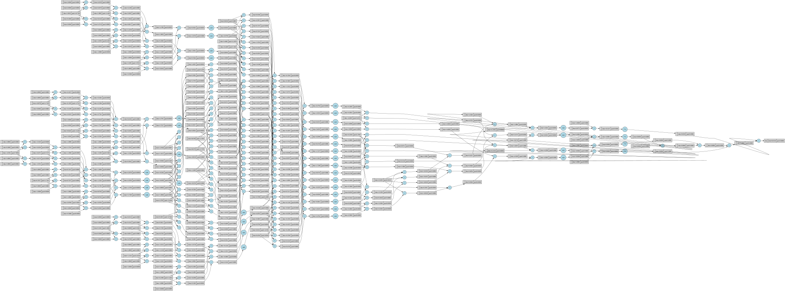

# Micrograd

A minimal scalar-valued **autograd engine** with a small **neural network library** built on top of it, implemented from scratch in Python. This project re-implements [Andrej Karpathy's micrograd](https://github.com/karpathy/micrograd) as a learning exercise to deeply understand how modern deep learning frameworks (PyTorch, TensorFlow) compute gradients via reverse-mode automatic differentiation.

> Inspired by Andrej Karpathy's excellent ["The spelled-out intro to neural networks and backpropagation"](https://www.youtube.com/watch?v=VMj-3S1tku0) YouTube lecture.

---

## ✨ Features

- **Autograd engine** (`engine.py`) — a `Value` class that:
  - Supports `+`, `-`, `*`, `/`, `**`, `exp`, `tanh`, `ReLU`
  - Builds a dynamic computation graph (DAG)
  - Performs reverse-mode automatic differentiation via `.backward()`
- **Neural network library** (`neural_network.py`):
  - `Neuron`, `Layer`, and `MLP` (Multi-Layer Perceptron) classes
  - PyTorch-like API (`.parameters()`, `.zero_grad()`)
- **Computation graph visualization** using Graphviz (see `graph.svg`)

---


## 🚀 Quick Start

### Installation
```bash
git clone https://github.com/amr10w/micrograd.git
cd micrograd
pip install -r requirements.txt
```

### Example: Basic Autograd
```python
from micrograd.engine import Value

a = Value(2.0)
b = Value(-3.0)
c = a * b + b**2
c.backward()

print(a.grad)  # dc/da
print(b.grad)  # dc/db
```

### Example: Training an MLP
```python
from micrograd.neural_network import MLP

model = MLP(3, [4, 4, 1])  # 3 inputs, two hidden layers of 4, 1 output

xs = [[2.0, 3.0, -1.0], [3.0, -1.0, 0.5], [0.5, 1.0, 1.0], [1.0, 1.0, -1.0]]
ys = [1.0, -1.0, -1.0, 1.0]

for k in range(100):
    ypred = [model(x) for x in xs]
    loss = sum((yout - ygt)**2 for ygt, yout in zip(ys, ypred))

    for p in model.parameters():
        p.grad = 0.0
    loss.backward()

    for p in model.parameters():
        p.data += -0.05 * p.grad

    print(k, loss.data)
```

---

## 📊 Computation Graph

Below is a visualization of the computation graph generated:



---

## 🧠 What I Learned

- How **reverse-mode automatic differentiation** works under the hood
- How frameworks like **PyTorch** build dynamic computation graphs
- How backpropagation is implemented as **local gradient × upstream gradient** (chain rule) at each node
- How to design a clean, minimal API for tensor-like operations
- How to structure a small Python library

---

## 📚 References

- [micrograd by Andrej Karpathy](https://github.com/karpathy/micrograd)
- [The spelled-out intro to neural networks and backpropagation: building micrograd](https://www.youtube.com/watch?v=VMj-3S1tku0)

---
